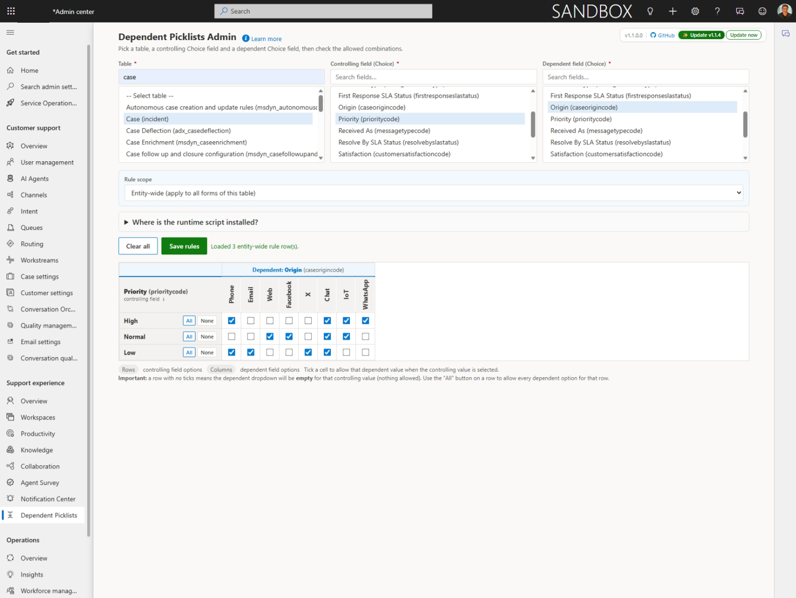
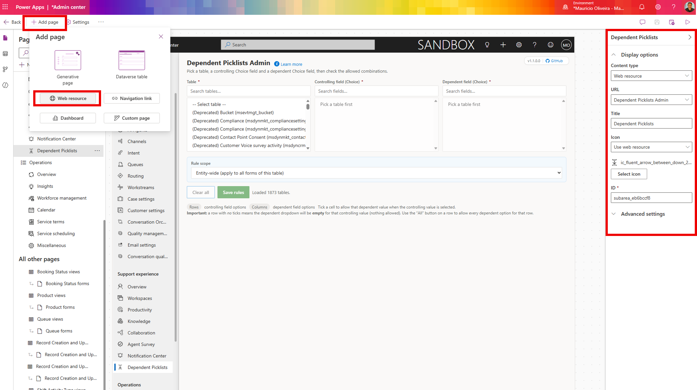
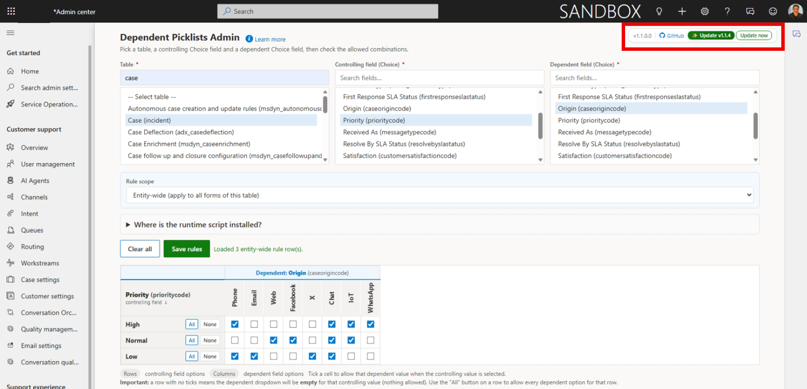

# Dependent Picklists for Dynamics 365

Make your forms smarter — and easier to use — without writing a line of code.

This solution lets administrators set up **dependent dropdowns** on any Dynamics 365 form (for example: when the user picks **Origin = Phone**, only show **Type = Question** or **Problem**). It also colors each option with the color you already defined in the option set — no extra work needed.

> Works on any table — standard or custom — and on any Choice (option set) field.

---

## 📑 Contents

- [✨ What it does for your team](#-what-it-does-for-your-team)
- [🚀 Install (5 minutes)](#-install-5-minutes)
- [🧭 Add the admin page to the Customer Service Admin Center](#-add-the-admin-page-to-the-customer-service-admin-center)
- [🎯 Set up your first dependent dropdown](#-set-up-your-first-dependent-dropdown)
- [🎛️ Rule scope: entity-wide vs form-specific (v1.1+)](#️-rule-scope-entity-wide-vs-form-specific-v11)
- [📋 Copy rules from another form (v1.1+)](#-copy-rules-from-another-form-v11)
- [❓ FAQ](#-faq)
- [🆕 Updating to a new version](#-updating-to-a-new-version)
- [📄 License](#-license)

---

## ✨ What it does for your team

- **Cleaner forms** — users only see the choices that make sense for the situation they're in.
- **Better data quality** — invalid combinations simply aren't available.
- **Color cues** — the same color you set in your option set shows up on the form, both in the open dropdown and on the selected value.
- **No code, no plugins** — everything is configured through a simple matrix screen.

---

## 🚀 Install (5 minutes)

1. Go to the [Releases page](../../releases) and download **`DependentPicklists_managed.zip`**.
2. Open **[Power Apps](https://make.powerapps.com)** → make sure you're in the right environment (top-right corner).
3. In the left menu click **Solutions** → **Import solution** → **Browse** → pick the zip you downloaded.
4. Click **Next** → **Import**. Wait until you see "Solution imported successfully" (about a minute).

That's it — the solution is in your environment.

---

## 🧭 Add the admin page to the Customer Service Admin Center

Most of your team won't go hunting for a web resource by URL. The cleanest way to expose the admin page is to add it as a navigation entry in the **Customer Service Admin Center** app, so it appears in the left sidebar just like any other section.

### Step 1 — Open the Customer Service Admin Center for editing

1. In **[Power Apps](https://make.powerapps.com)**, click **Solutions** in the left menu.
2. Open the **Default Solution** (or the unmanaged solution where you keep your customizations).
3. Click **+ Add existing** → **App** → **Model-driven app** → tick **Customer Service admin center** → **Add**.
4. After it appears in the solution, click **…** next to it → **Edit** → **Edit in preview**. The modern app designer opens in a new tab.

### Step 2 — Add a new menu entry

1. In the left **Pages** panel, scroll to the **Navigation** section and click it (the icon looks like a list/menu).
2. Pick the **Group** where you want the entry to live (for example **Customer support**, or use **+ New group** to create one called **Customizations**).
3. Click **+ New** → **Subarea**.
4. On the right pane fill in:
   - **Content type**: *Web resource*
   - **URL**: `mau_DependentPicklistAdmin.html`
   - **Title**: *Dependent Picklists*
   - **Icon**: *Use default* (or pick the **Settings** icon)
   - **ID**: `mau_dependentpicklists` (lowercase, no spaces)
5. Click **Save** in the top-right, then **Publish**.

### Step 3 — Try it

1. Back in Power Apps, go to **Apps**, click **Customer Service admin center** → **Play**.
2. In the left navigation you should now see **Dependent Picklists** under the group you picked.
3. Click it — the matrix admin page opens.

> **Tip:** the same web resource works in any model-driven app. To put it inside the **Customer Service Hub** or your own custom app, just repeat Step 2 in that app's site map.

---

## 🎯 Set up your first dependent dropdown

1. Open the **Dependent Picklists** page from the left navigation.
2. Pick the **Table** (for example *Case*).
3. Pick the **Controlling field** — the dropdown the user chooses **first** (for example *Origin*).
4. Pick the **Dependent field** — the dropdown that should change based on the first one (for example *Type*).
5. The matrix appears. **Tick the boxes** for each combination you want to allow:
   - Each **row** is a value of the controlling field (Origin: Phone, Email, Web…).
   - Each **column** is a value of the dependent field (Type: Question, Problem, Request…).
   - Tick a box to allow that combination.
   - **Leave a row empty** if you want to *block all* dependent values when that controlling value is picked.
6. Scroll down to **Forms to apply runtime script to** and tick the form(s) where this should run (typically the Case form your agents use).
7. Click **Save rules** and then **Save** under the forms list.
8. Open any Case form and **hard refresh with Ctrl + F5**. Try it — pick *Origin = Phone* and watch the *Type* dropdown change.

That's the whole loop. Come back any time to add, change, or remove rules.

---

## 🎛️ Rule scope: entity-wide vs form-specific (v1.1+)

Most of the time you want one set of rules to apply on **every form of a table** — that's called **Entity-wide** (the default). But sometimes the same field pair needs **different rules on a different form** — that's **Form-specific**.

At the top of the matrix screen you'll see a **Rule scope** picker:

- **Entity-wide (apply to all forms of this table)** — the rules you save here apply on every form where the runtime script is registered. This is what you want 95% of the time.
- **Form-specific (apply only to one form)** — pick a form from the **Form** dropdown that appears. Rules saved here apply **only** on that form.

**How precedence works:** if a form-specific rule exists for a field pair on a given form, it **fully replaces** the entity-wide rules for that same field pair on that form only. Other field pairs and other forms are not affected.

> Tip: switch the scope back and forth at the top — the matrix reloads each time so you always see exactly the rules that will apply at that scope.

---

## 📋 Copy rules from another form (v1.1+)

When you're setting up a **form-specific** rule, you usually don't want to start from a blank matrix — you want the entity-wide rules (or rules from a sibling form) as your starting point, and then tweak a few ticks.

That's what the **Copy rules from another form** button does. You'll find it right above the matrix whenever you've picked a form-specific scope:

1. Click **Copy rules from another form**.
2. Pick the **source** — either *Entity-wide* or any other form that already has rules for this same field pair.
3. Click **Load into matrix**. The matrix is pre-filled with the source's allowed combinations.
4. Adjust the ticks as needed and click **Save rules**.

Nothing is saved until you hit **Save rules**, so you can experiment freely.

---

## ❓ FAQ

**Will this work for my custom table / custom choice field?**
Yes. The solution doesn't care whether the table or field is standard (out-of-box) or custom — as long as both fields are Choice (option set) fields on the same form.

**Where do the colors on the dropdown come from?**
From the **color you set on each option** in Power Platform's choice editor (Solutions → your column → edit each option → Color). The runtime reads that color and paints the dropdown accordingly. If no color is set, the option renders without a colored pill.

**A user changed something on the form and the dropdown looks wrong.**
Ask them to do a hard refresh (**Ctrl + F5**). Dynamics caches form scripts very aggressively.

**A new version of this solution was released — how do I know?**
The admin page checks GitHub on every load. When a newer release is available, a small green **✨ Update** pill appears in the top-right corner of the page, next to the version number. Click it to go straight to the Releases page and download the latest zip.

**Can I uninstall it cleanly?**
Yes. Power Apps → Solutions → tick **Dependent Picklists** → **Delete**. Your business data, tables and choice fields are not affected — the solution only removes its own configuration table and web resources.

---

## 🆕 Updating to a new version

**Good news — you don't have to check for updates yourself.** Every time you open the **Dependent Picklists** admin page, it quietly checks GitHub for a newer release. When one is available, a small green **✨ Update** pill appears in the top-right corner of the page, next to the version number. Click it to go straight to the Releases page and download the latest zip.

Prefer to do it manually? Just download the latest **`DependentPicklists_managed.zip`** from [Releases](../../releases) and import it the same way you did the first time — Power Apps detects it's an upgrade and handles the rest automatically.

---

## 📄 License

MIT — see [LICENSE](LICENSE).
